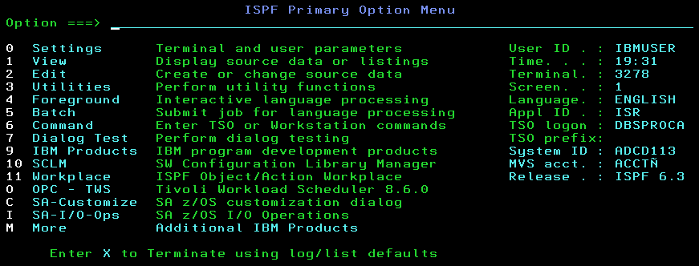

👋 ¡Hola! Soy Técnico Programador en formación
 

💻 Especializándome en sistemas mainframe, con experiencia en COBOL, JCL y JAVA. Actualmente, soy becario en Banco Nación Argentina, donde trabajo con tecnologías críticas para el sector bancario.

🚀 Tecnologías y herramientas:
🖥️ COBOL & CICS
 
Desarrollo y mantenimiento de sistemas bancarios.
Administración de transacciones en CICS.
Implementación de mejoras y corrección de errores.
 

📡 JCL (Job Control Language)

Creación y ejecución de JCLs en z/OS.
Uso de herramientas como IEBUPDTE, ADRDSSU, IDCAMS, IEFBR14, IEBGENER.
 

🔗 z/OS Connect

Configuración de APIs RESTful para integrar mainframe con sistemas modernos.
Optimización de servicios en entornos bancarios.
 

🔍 Debugging & Testing

Uso de Debug Tool V15 para COBOL y Assembler.
Pruebas funcionales e integración en entornos de alta demanda.
 

📈 En constante aprendizaje
 

Me apasiona el mundo del mainframe y la tecnología bancaria. Busco mejorar mis habilidades y contribuir a proyectos relacionados con la modernización y optimización de sistemas críticos.

