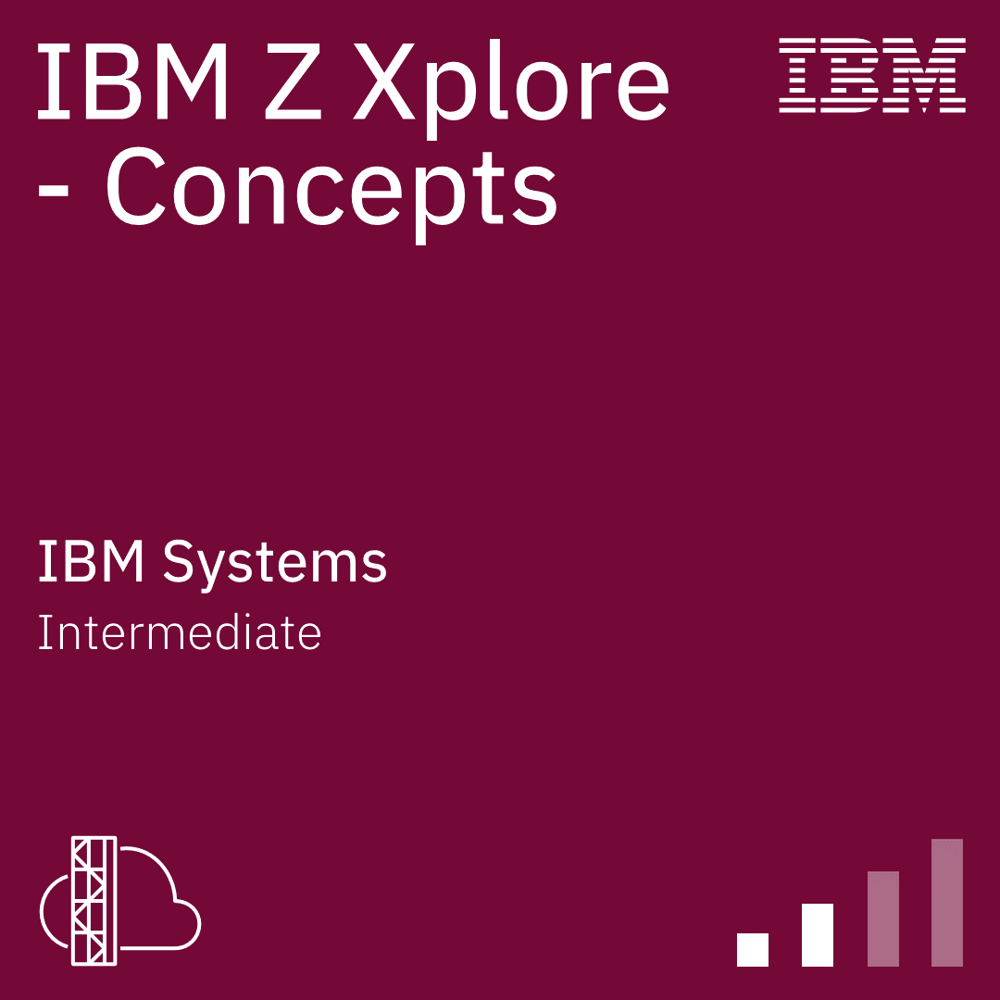
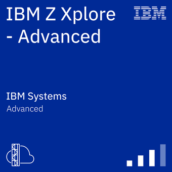
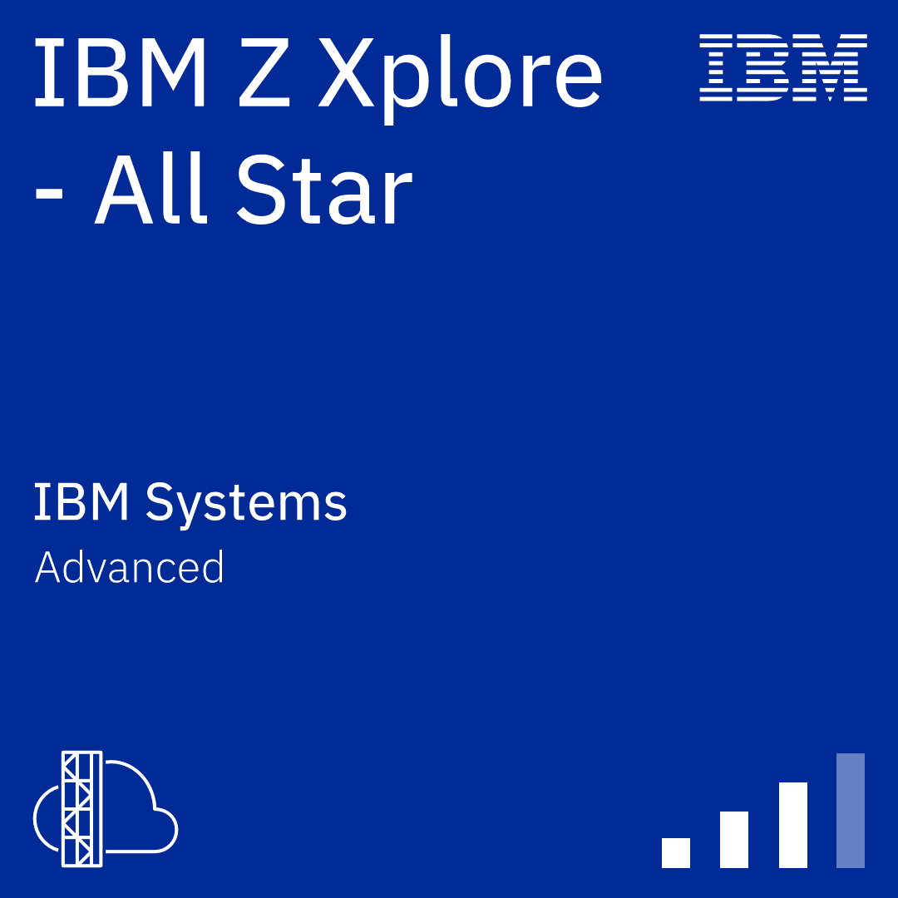

# 👋 Hola, soy Luciano Agustín Aquino

🎯 Mainframe Developer @ Fiserv | COBOL • z/OS Connect • CICS • APIs REST 

## 🚀 Tecnologías
- COBOL · JCL · CICS · BMS
- z/OS · z/OS Connect
- Omegamon · Debug Tool · ISHELL · SDSF

## 📂 Repositorios destacados
- `cobol-cics-link-commarea` → Ejemplo de programa COBOL–CICS LINK COMMAREA.  
- `jcl-samples` → Jobs de práctica en JCL.  
- `cobol-batch-exercises` → Programas COBOL batch básicos.  

📫 Conectemos en [LinkedIn](https://www.linkedin.com/in/luciano-agustin-aquino-02058a1a3)
 
 

[Press ENTER to continue...]

